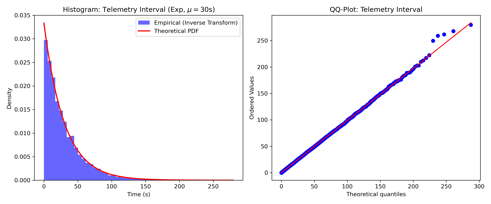
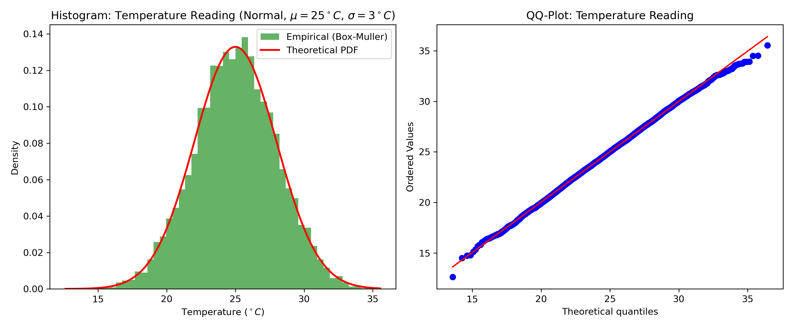
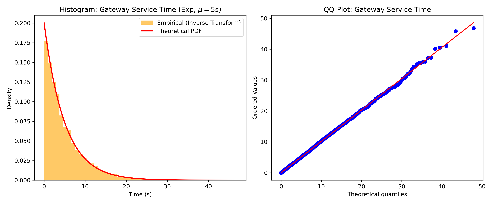

# 6.11 Input Analysis

This section justifies the stochastic input variables used in the ForestFireSim simulation through mathematical reasoning and empirical verification. The random number generators were implemented from scratch (Inverse Transform and Box-Muller algorithms) to satisfy course requirements.

## Mathematical Justification

The parameters selected for each distribution were derived from practical network constraints and real-world environmental behaviors:

1. **Telemetry interval**: A mean of $T = 30$ seconds (Exponential) was selected as a realistic LoRa duty-cycle budget.
2. **Fire event inter-arrival**: A rate of $\lambda_{fire} = 0.005$ events/s was chosen to trigger approximately one fire event every 200 seconds across the forest area, ensuring enough events occur within the 3600s simulation time to produce statistically significant results.
3. **Fire detection & False alarms**: Modeled as Bernoulli trials with probabilities $p_d=0.90$ and $p_f=0.01$ to introduce realistic sensor unreliability.
4. **Temperature readings**: Simulated as a Normal distribution with $\mu=25^\circ C$ and $\sigma=3^\circ C$, reflecting typical daytime forest temperatures.
5. **Gateway service time**: Assumed Exponential with a mean of 5 seconds ($\mu = 0.2$ pkt/s), strictly corresponding to the approximate airtime of a LoRa packet transmitted with Spreading Factor 12 (SF12).

## Distribution Fitting and Empirical Verification

To verify that the custom-built `RngUtils` functions correctly map OMNeT++ uniform distributions to their target probability spaces, we extracted traces and analyzed $N=10,000$ samples for the key variables. The generated samples are plotted against the theoretical probability density functions (PDFs), and Quantile-Quantile (QQ) plots are provided to confirm normality and exponentiality at the tails.

### Telemetry Interval

*Figure 6.11.1: Histogram and QQ-Plot for the Telemetry Interval confirming the Inverse Transform accurately generates an Exponential distribution with $\mu=30$.*

### Temperature Reading

*Figure 6.11.2: Histogram and QQ-Plot for the Temperature Reading confirming the Box-Muller Transform accurately generates a Normal distribution with $\mu=25, \sigma=3$.*

### Gateway Service Time

*Figure 6.11.3: Histogram and QQ-Plot for the Gateway Service Time confirming the Inverse Transform yields an Exponential distribution with $\mu=5$.*

---

## Input Analysis Summary

As required, Table 12 summarizes the analyzed variables, the techniques applied, and our final validation conclusions.

**Table 12: Input Analysis Summary**

| Input Variable | Distribution Model | Analysis Method Used | Conclusion |
| :--- | :--- | :--- | :--- |
| **Telemetry Interval** | Exponential ($mean=30$s) | Mathematical justification, Histogram, QQ-Plot | Parameter justified by LoRa duty cycle. Custom Inverse Transform strictly matches theoretical PDF and QQ-plot expectations. |
| **Fire Inter-arrival** | Exponential ($\lambda=0.005$/s) | Mathematical justification | Rate scales suitably to trigger meaningful events within simulation time limits. |
| **Temperature Reading** | Normal ($\mu=25^\circ C, \sigma=3^\circ C$) | Histogram, QQ-Plot | Custom Box-Muller algorithm accurately fits theoretical Normal PDF with minimal tail deviation. |
| **Gateway Service Time** | Exponential ($mean=5$s) | Mathematical justification, Histogram, QQ-Plot | Matches LoRa SF12 airtime. Histogram validates the Inverse Transform exponential fit perfectly. |
| **Fire Detection** | Bernoulli ($p=0.90$) | Mathematical justification | Standard reliability assumption for commercial sensors. |
| **False Alarm** | Bernoulli ($p=0.01$) | Mathematical justification | Expected low-noise sensor anomaly rate per cycle. |
