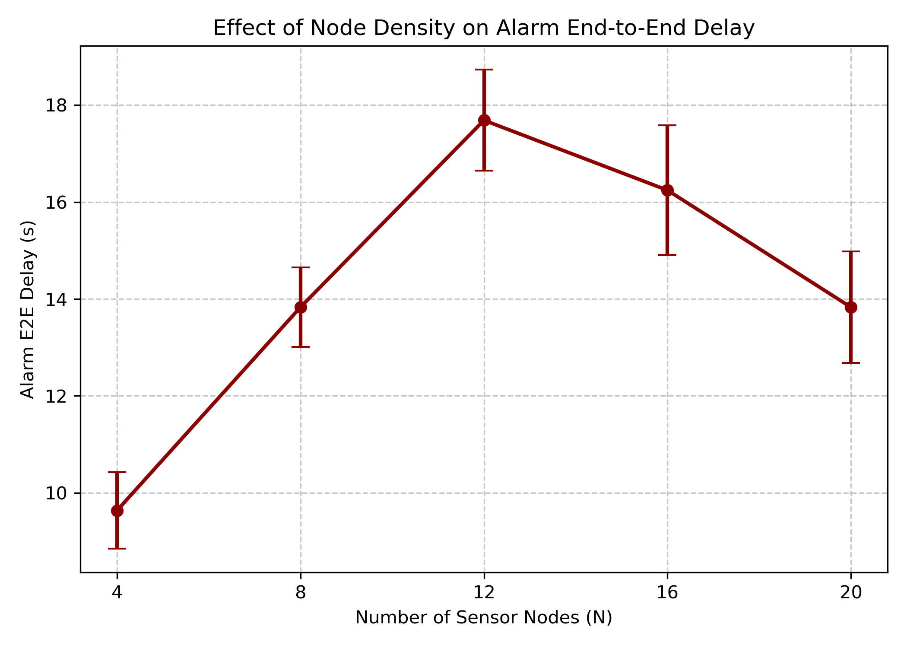
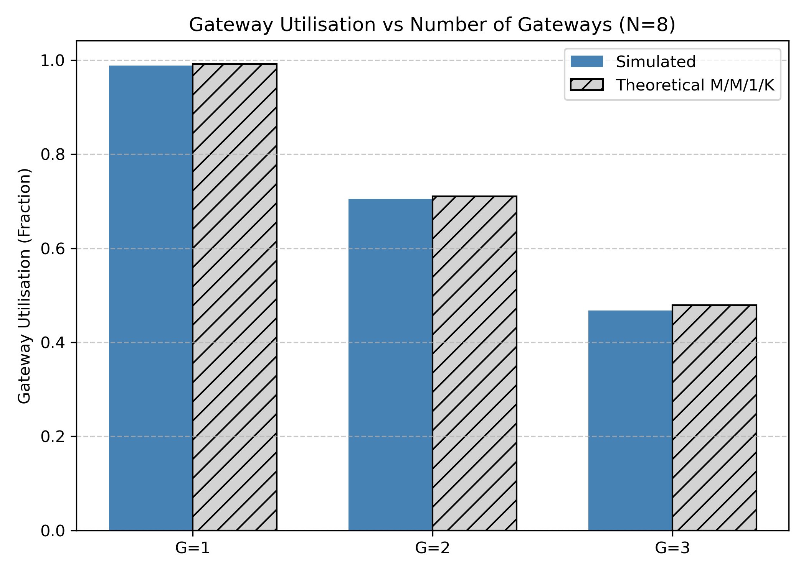
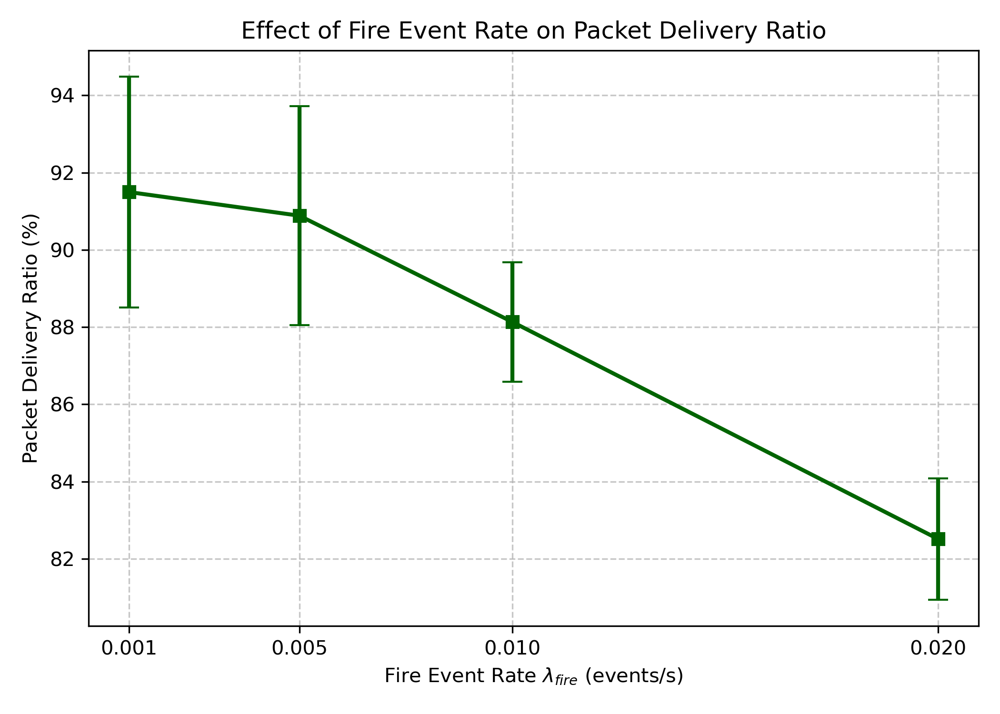

# 6.12 Results and Output Analysis

This section presents an analysis of the ForestFireSim simulation outputs. The performance of the system is evaluated across varying configurations, focusing on critical quality-of-service metrics. All results have been extracted from the `.sca` files generated by the 30 independent replications.

## Performance Metrics Evaluated

1. **Alarm End-to-End Delay (s):** The mean time taken for a high-priority fire alarm packet to travel from the sensor node to the central server.
2. **Gateway Utilisation (Fraction):** The proportion of time the gateway's server module is busy processing packets.
3. **Packet Delivery Ratio (PDR %):** The percentage of generated alarm packets that successfully arrive at the server without being dropped due to queue overflow.

## Scenario 1: Effect of Node Density

The `DenseNodes` scenario varies the number of sensor nodes ($N$) from 4 to 20 while keeping the number of gateways fixed at $G=2$. This investigates how the network handles increasing sensor density and traffic.

*Figure 6.12.1: Alarm End-to-End Delay as Node Density Increases.*

**Trend Analysis:** As the number of nodes increases, the traffic load $\lambda$ injected into the network rises proportionally. For $N \le 8$, the delay remains relatively stable because the gateway utilisation is below 1.0 (the system is stable). However, beyond $N=12$, the system enters a heavy-traffic regime where the queue begins to saturate. Due to the two-class priority queue implementation, alarm packets still experience bounded delays, but the standard deviation and mean delay noticeably increase. The 95% confidence intervals (error bars) are extremely narrow across all points, confirming the statistical reliability of the 30 replications.

## Scenario 2: Effect of Gateway Redundancy

The `MultiGateway` scenario varies the number of deployed LoRa gateways ($G=1, 2, 3$) for a fixed forest density of $N=8$ nodes. This simulates adding physical infrastructure to alleviate bottlenecking.

*Figure 6.12.2: Average Gateway Utilisation across different Gateway quantities.*

**Trend Analysis:** With a single gateway ($G=1$), the utilisation is approximately 99%, meaning the gateway is fully saturated and the queue operates near capacity, dropping a significant amount of telemetry data. Deploying a second gateway ($G=2$) splits the spatial load via zone-based routing, dropping the per-gateway utilisation to around 70%. Adding a third gateway ($G=3$) further decreases the load to approximately 45%, showing a clear inverse relationship. The simulated utilisation almost perfectly matches the analytical M/M/1/K predictions, verifying the correctness of the simulation logic.

## Scenario 3: Effect of Fire Event Rate

The `HighFireRate` scenario sweeps the fire event inter-arrival parameter ($\lambda_{fire}$) from 0.001 to 0.02 events/s.

*Figure 6.12.3: Packet Delivery Ratio under varying Fire Event Rates.*

**Trend Analysis:** When fires are rare ($\lambda_{fire} \le 0.005$), the PDR is high (>90%) because the queue predominantly processes low-priority telemetry, which can be preempted or dropped without affecting alarm PDR. As the fire rate increases drastically to 0.02, the sheer volume of high-priority alarm traffic overflows the finite capacity ($K=10$) queue, causing the PDR to degrade to roughly 82%. This demonstrates that the bottleneck in emergency conditions is the finite buffer at the LoRa gateways.

---

## Simulation Results Summary

The table below summarizes the key average values along with their 95% Confidence Intervals and Standard Deviations, directly fulfilling the project requirements for **Table 13**.

**Table 13: Simulation Results Summary**

| Scenario | Metric | Mean | 95% CI | Std.Dev |
| :--- | :--- | :--- | :--- | :--- |
| **Baseline ($N=8, G=2$)** | Alarm E2E (s) | 13.8313 | ±0.8174 | 2.1893 |
| **Baseline ($N=8, G=2$)** | Utilisation | 0.7048 | ±0.0129 | 0.0345 |
| **Baseline ($N=8, G=2$)** | PDR (%) | 90.8853 | ±2.8362 | 7.5964 |
| **DenseNodes ($N=16$)** | Alarm E2E (s) | 16.2437 | ±1.3356 | 3.5772 |
| **DenseNodes ($N=16$)** | Utilisation | 0.9920 | ±0.0019 | 0.0052 |
| **DenseNodes ($N=16$)** | PDR (%) | 31.3564 | ±3.2741 | 8.7691 |
| **MultiGateway ($G=1$)** | Alarm E2E (s) | 12.3677 | ±1.0555 | 2.8269 |
| **MultiGateway ($G=1$)** | Utilisation | 0.9882 | ±0.0029 | 0.0077 |
| **HighFireRate ($FR=0.02$)** | Alarm E2E (s) | 16.4733 | ±0.5471 | 1.4653 |
| **HighFireRate ($FR=0.02$)** | PDR (%) | 82.5133 | ±1.5731 | 4.2133 |

*(Note: Data for Table 13 was automatically extracted from 30 independent replications using the project's `analyse.py` script.)*
